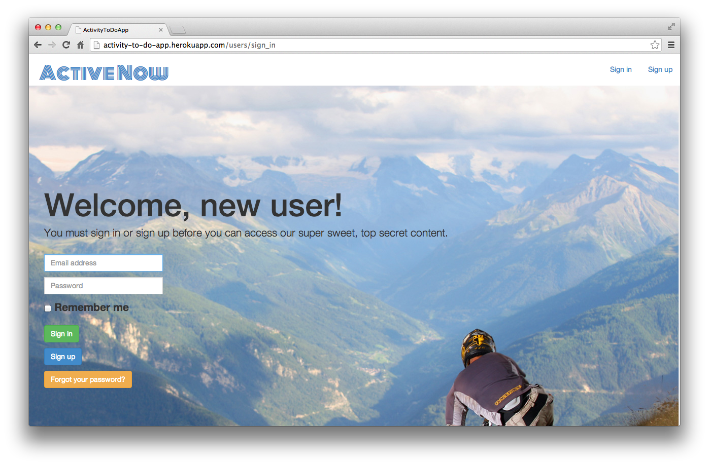
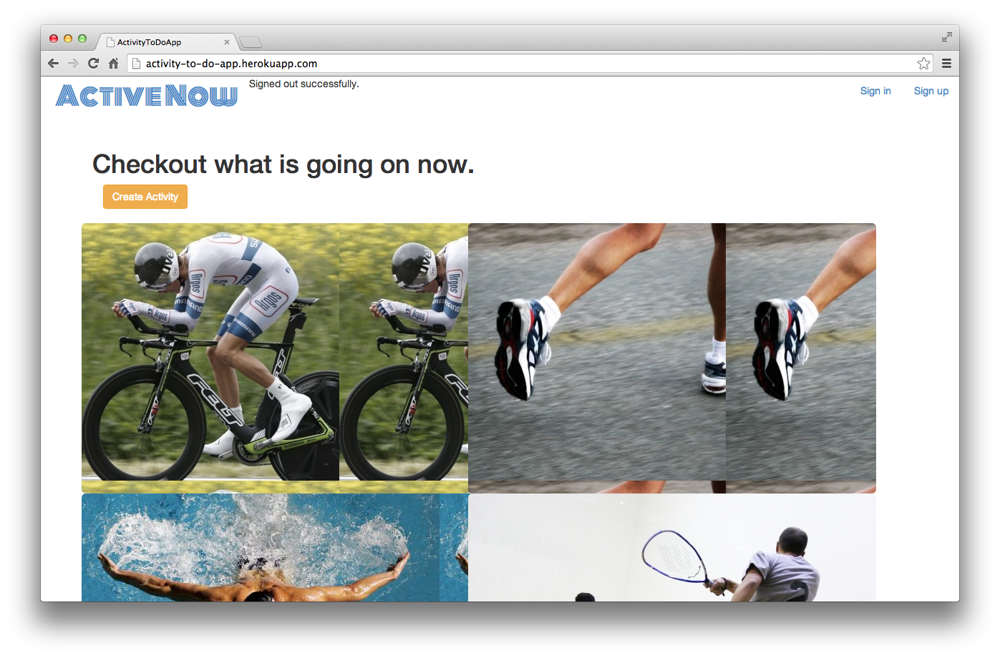
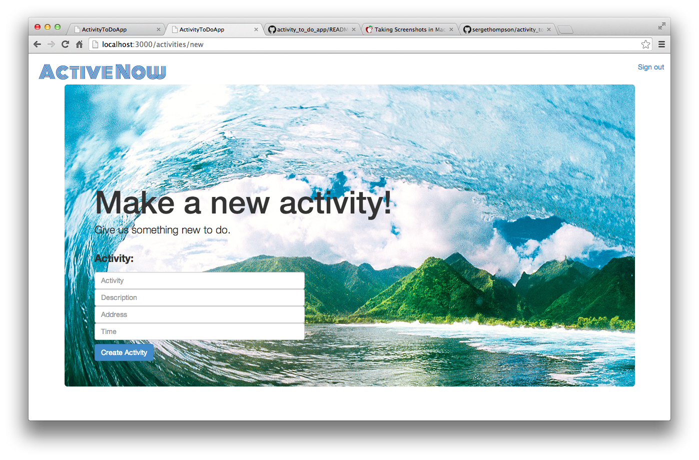

#Activity Now App

## Overview
Finding and creating local activities happeining now.

Heroku: http://activity-to-do-app.herokuapp.com/
  
###Things I thougth were cool coding-

####Playing with location objects.
```ruby

	@activity = Activity.all
	@ip_address = request.ip == "127.0.0.1" ? nil : request.ip
	@s = Geocoder.search @ip_address || "76.204.125.144"

## Organizing activities to with activity and distance from current location to activity location
	activity_dist = []

	activity_dist = @activity.map do |t| 
		array = []
		dist = t.distance_to(@s[0].address) || 30000
		array = [t, dist]
	end

## Sorting activities to with activity and distance nearest to farthest
	@sorted = activity_dist.sort {|a,b| a[1] <=> b[1]}
```

#### Using embeded ruby to make a map that shows an activity point and current location point that canges on every show page based on activity location.
```html
&zoom=13&size=600x300&maptype=roadmap
&markers=color:red%7Clabel:A%7C<%= @activity.latitude %>,<%= @activity.longitude %>&markers=color:green%7Clabel:C%7C<%= @s[0].latitude %>,<%= @s[0].longitude %>&sensor=false" alt="">
```
####When user is logged in this allows them to join the group, if the user is not logged in it sends them to the login page.
```html
<h3>Active Group:</h3>
<% @activity.users.each do |x| %>
  <h6><%= x.email %></h6><br>
<% end %>

<% if current_user %>
	<form action="/activity_users" method="post">
  	<input type="hidden" name="activity" value="<%=@activity.id%>">
 	 <input type="hidden" name="user" value="<%=@user.id%>">
 	 <button class="btn btn-primary" id="submit">Join Activity</button>
  	<input name="authenticity_token" 
                         	   type="hidden" 
                            	value="<%= form_authenticity_token %>" />
	</form>
<% else %>
  <%= link_to "Sign in to join", new_user_session_path, {:class => "btn btn-primary"} %>
<% end %>
```

####Selecting activities by names was a neat way to display all the items of a certian type.
```html
<% @sorted.each do |to_do| %>
	<% if to_do[0].activity == "Run" %>
		<tr>
			<td><%= to_do[0].activity %></td>
			<td><%= to_do[0].users[0].email %></td>
			<td><%= Time.at(to_do[0].time.to_f).ctime %></td>
			<td><%= to_do[0].address %></td>
			<td><%= to_do[0].description %></td>
			<td><%= to_do[1].round(2) %></td>
			<td><%= link_to to_do[0].activity, to_do[0] %></td>
		</tr>
	<% end %>
```







